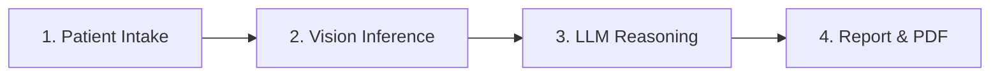
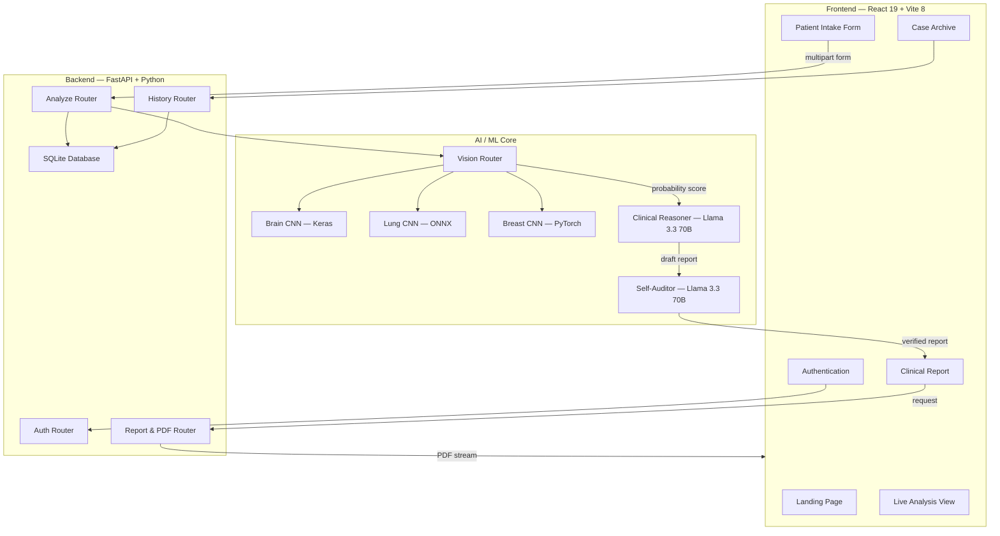
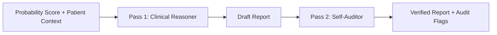

<p align="center">
  
  <br/><br/>
  
  
  
  
</p>

# OncoDetect

**OncoDetect** is a full-stack AI-powered cancer triage system that processes medical imaging scans (Brain MRI, Lung CT, Breast Mammography) through deep learning models, interprets the results using a large language model, and generates clinician-ready diagnostic reports — all within a single, seamless web application.

> **Disclaimer:** This is a research prototype. It is not a certified medical device and must not be used for real clinical diagnosis.

---

## How It Works

The application follows a structured 4-stage diagnostic pipeline:



| Stage | What Happens |
|:------|:-------------|
| **Patient Intake** | Clinician enters demographics, symptoms, selects organ type, and uploads the medical scan |
| **Vision Inference** | The scan is routed to an organ-specific CNN model that outputs a malignancy probability score |
| **LLM Reasoning** | Llama 3.3 70B analyzes the probability alongside clinical context to produce a structured report. A second LLM pass audits the report for safety |
| **Report & PDF** | The final report is displayed in the UI and can be downloaded as a professionally formatted PDF |

---

## System Architecture



---

## ML Models

Each organ type is handled by a dedicated pretrained model sourced from Hugging Face:

| Organ | Model | Framework | Classes | How Risk Is Calculated |
|:------|:------|:----------|:--------|:-----------------------|
| **Brain** | `jawadskript/brain_tumor_detection` | Keras (TensorFlow) | Glioma, Meningioma, **No Tumor**, Pituitary | `1.0 − P(no_tumor)` |
| **Lung** | `dorsar/lung-cancer-detection` | ONNX Runtime | Adenocarcinoma, Large Cell, **Normal**, Squamous | `1.0 − P(normal)` |
| **Breast** | `ianpan/mammoscreen` | PyTorch | Multi-class BIRADS | `max(malignant probabilities)` |

> The **Vision Router** (`backend/reasoning/vision_router.py`) handles automatic model selection, image preprocessing, and probability extraction based on the organ type submitted in the intake form.

---

## LLM Reasoning Pipeline

After the vision model produces a probability score, the backend passes it — along with the patient's age, gender, and clinical notes — into a two-stage LLM pipeline powered by **Llama 3.3 70B** via the Groq API:



**Pass 1 — Clinical Reasoner:** Generates a structured JSON report containing:
- Risk summary and triage level (Low / Medium / High)
- Doctor-facing clinical explanation
- Patient-friendly plain-language summary
- Differential diagnosis hints
- Recommended next steps

**Pass 2 — Self-Auditor:** Reviews the draft report and flags anything that could be:
- Medically dangerous or misleading
- Inconsistent with the probability score
- Missing critical safety disclaimers

If no Groq API key is configured, the system gracefully falls back to a deterministic template-based report so the app still works end-to-end.

---

## Features

| Category | Details |
|:---------|:--------|
| **Authentication** | Token-based protected routes with session validation on refresh and `/api/auth/me` |
| **Clinical Intake** | Multi-step wizard with demographics, optional risk context, organ selection, and validated image upload |
| **Live Analysis** | Real-time scanning animation with typing terminal, pipeline progress tracker, and resource telemetry |
| **Reporting** | Structured clinical report with triage badge, reasoning trace, audit notes, copy summary, and PDF export |
| **PDF Export** | Server-side PDF generation via ReportLab with proper list alignment and professional formatting |
| **Case History** | All past analyses are saved to SQLite and browsable from the dashboard |
| **Operational Readiness** | Health endpoint, startup env examples, backend tests, and deployment-oriented configuration cleanup |
| **Responsive Design** | Flexbox-based layout with glassmorphism, neon accents, and dark mode throughout |

---

## Project Structure

```
OncoDetect/
├── backend/
│   ├── main.py                  # FastAPI application entry point
│   ├── database.py              # SQLAlchemy engine & session
│   ├── models/
│   │   └── schemas.py           # Pydantic models & SQLAlchemy ORM
│   ├── reasoning/
│   │   ├── vision_router.py     # Multi-framework ML inference
│   │   ├── clinical_reasoner.py # LLM report generation (Groq)
│   │   └── self_auditor.py      # LLM safety audit pass
│   ├── routers/
│   │   ├── auth.py              # Login & token management
│   │   ├── cases.py             # /api/analyze endpoint
│   │   ├── history.py           # /api/reports endpoints
│   │   └── report.py            # /api/report/generate (PDF)
│   ├── tests/                   # Backend regression coverage
│   ├── .env.example             # Backend environment template
│   └── requirements.txt
├── frontend/
│   ├── .env.example             # Frontend environment template
│   ├── src/
│   │   ├── pages/               # Entrance, SignIn, Dashboard, NewAnalysis, Analysis, Report
│   │   ├── components/          # Navbar, AppLayout, Toast, ErrorBoundary
│   │   ├── context/             # PatientContext (global state)
│   │   └── lib/                 # Axios API client
│   ├── index.html
│   └── vite.config.js
├── render.yaml                  # Legacy Render blueprint kept for reference
├── start.sh                     # One-command local dev server
└── README.md
```

---

## Getting Started

### Prerequisites

- Python 3.11+
- Node.js 20+
- A free [Groq API Key](https://console.groq.com/) *(optional but recommended)*

### Run Locally

```bash
# 1. Clone the repository
git clone https://github.com/vishva2410/ONCO-DETECT-.git
cd ONCO-DETECT-

# 2. Create local env files
cp backend/.env.example backend/.env
cp frontend/.env.example frontend/.env.local

# 3. (Optional) Add your Groq key
# edit backend/.env and set GROQ_API_KEY=your_key_here

# 4. Start everything
chmod +x start.sh && ./start.sh
```

The startup script handles virtual environment creation, dependency installation, and launches both servers automatically.

| Service  | URL |
|:---------|:----|
| Frontend | http://localhost:5173 |
| Backend  | http://localhost:8000 |
| API Docs | http://localhost:8000/docs |
| Health   | http://localhost:8000/api/health |

**Local development credentials:** `admin` / `password123`

For deployed environments, set `DEFAULT_ADMIN_USERNAME`, `DEFAULT_ADMIN_PASSWORD`, and a strong `JWT_SECRET` in the backend service configuration.

**Supported local upload formats:** `PNG`, `JPG`, and `WEBP`

---

## API Reference

| Method | Endpoint | Description |
|:-------|:---------|:------------|
| `POST` | `/api/auth/login` | Authenticate and receive a bearer token |
| `GET`  | `/api/auth/me` | Validate the current bearer token and return the active username |
| `GET`  | `/api/health` | Check API/database readiness and runtime mode |
| `POST` | `/api/analyze` | Submit patient data + scan for full pipeline analysis |
| `GET`  | `/api/reports` | Retrieve all saved case reports |
| `GET`  | `/api/reports/{id}` | Retrieve a specific report by ID |
| `POST` | `/api/report/generate` | Generate and download a PDF report |

---

## Deployment Prep

The repository is now prepared for container-friendly deployment with:
- explicit environment templates for frontend and backend
- a health endpoint for readiness checks
- authenticated smoke-test coverage for core API flows
- startup configuration that avoids unsafe production defaults

The existing `render.yaml` remains as a legacy reference only. In the next deployment pass, the recommended target will be a non-Render platform.

---

## License

This project is open for portfolio, educational, and academic use.
