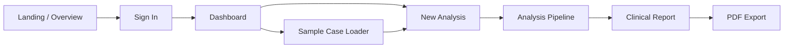
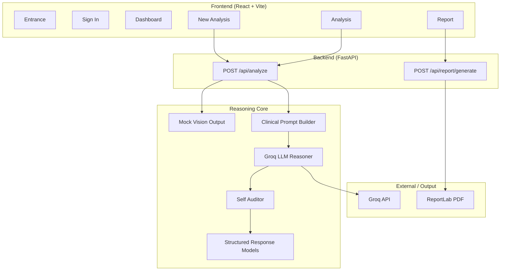
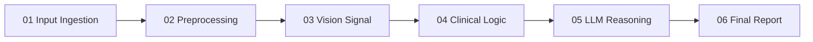
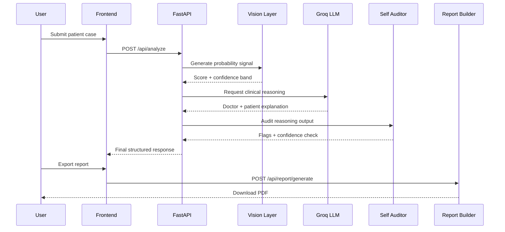
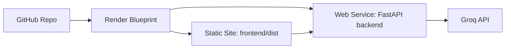

<p align="center">
  
</p>

<h1 align="center">OncoDetect</h1>

<p align="center">
  <b>AI-assisted multi-organ cancer triage workspace</b><br />
  <sub>Clinical intake • imaging signal simulation • LLM reasoning • self-audited reporting</sub>
</p>

<p align="center">
  
  
  
  
  
</p>

<p align="center">
  <a href="#overview">Overview</a> •
  <a href="#experience-map">Experience Map</a> •
  <a href="#architecture">Architecture</a> •
  <a href="#pipeline">Pipeline</a> •
  <a href="#quick-start">Quick Start</a> •
  <a href="#deployment">Deployment</a> •
  <a href="#api-snapshot">API Snapshot</a>
</p>

---

## Overview

**OncoDetect** is a full-stack AI triage prototype for **brain**, **lung**, and **breast** screening workflows. It combines:

- structured patient intake
- simulated imaging model output
- Groq-powered LLM clinical reasoning
- self-audit verification
- PDF-ready reporting

The project is designed as a **professional demo workspace**, not a diagnostic system.

> [!IMPORTANT]
> This repository is for **academic, portfolio, and demonstration use only**. It does **not** provide real medical diagnoses, and every output must be reviewed by a qualified clinician.

---

## Why It Stands Out

| Area | What It Does |
| :-- | :-- |
| **Clinical Intake** | Captures demographics, symptoms, history, organ type, and scan upload |
| **AI Simulation** | Produces organ-specific probability output and confidence bands |
| **LLM Reasoning** | Generates both doctor-facing and patient-facing explanations |
| **Self-Audit** | Runs a second-pass review over reasoning quality and reliability |
| **Reporting** | Exports structured results into a downloadable PDF |
| **Frontend UX** | Includes animated progress states, dashboard surfaces, and case workflows |

---

## Experience Map



### Core Screens

| Screen | Purpose |
| :-- | :-- |
| **Entrance** | Product introduction and visual system entry point |
| **Sign In** | Demo authentication gateway |
| **Dashboard** | Workspace overview, metrics, and actions |
| **New Analysis** | Patient intake and scan upload |
| **Analysis** | Live multi-stage processing flow |
| **Report** | Final triage output with explanation, audit, and export |

---

## Architecture



---

## Pipeline

### 6-Stage Triage Flow



### What Happens at Each Stage

| Stage | Responsibility | Output |
| :-- | :-- | :-- |
| **01 Input Ingestion** | Reads patient demographics, symptoms, and scan file | structured case packet |
| **02 Preprocessing** | Normalizes and validates input for downstream analysis | normalized analysis context |
| **03 Vision Signal** | Produces organ-specific probability and confidence band | simulated model score |
| **04 Clinical Logic** | Applies triage thresholds and risk labeling | low / moderate / high triage |
| **05 LLM Reasoning** | Creates clinical narrative and patient summary | doctor + patient explanations |
| **06 Final Report** | Packages reasoning, audit, and recommendations | report-ready JSON + PDF export |

### Sequence View



---

## Tech Stack

### Frontend

- **React 19**
- **Vite 8**
- **Tailwind CSS 4**
- **Framer Motion**
- **Axios**
- **Lucide React**

### Backend

- **FastAPI**
- **Uvicorn**
- **Pydantic**
- **Groq SDK**
- **python-dotenv**
- **ReportLab**

---

## Project Structure

```text
oncodetect/
├── backend/
│   ├── main.py
│   ├── requirements.txt
│   ├── models/
│   ├── reasoning/
│   └── routers/
├── frontend/
│   ├── package.json
│   ├── vite.config.js
│   └── src/
│       ├── components/
│       ├── context/
│       ├── hooks/
│       └── pages/
├── render.yaml
└── README.md
```

---

## Quick Start

### 1. Clone

```bash
git clone https://github.com/vishva2410/ONCO-DETECT-.git
cd ONCO-DETECT-
```

### 2. Backend

```bash
cd backend
python -m venv venv
source venv/bin/activate
pip install -r requirements.txt
echo "GROQ_API_KEY=your_key_here" > .env
uvicorn main:app --reload --port 8000
```

Windows:

```bash
venv\Scripts\activate
```

### 3. Frontend

```bash
cd frontend
npm install
npm run dev
```

### 4. Open the App

```text
Frontend: http://localhost:5173
Backend:  http://localhost:8000
```

---

## Deployment

This repo includes a **Render blueprint** via `render.yaml`.

### Deployment Topology



### Render Setup

| Service | Root | Build Command | Start / Publish |
| :-- | :-- | :-- | :-- |
| **Backend** | `backend` | `pip install -r requirements.txt` | `uvicorn main:app --host 0.0.0.0 --port $PORT` |
| **Frontend** | `frontend` | `npm ci && npm run build` | `dist` |

### Required Environment Variables

| Variable | Required | Purpose |
| :-- | :--: | :-- |
| `GROQ_API_KEY` | Yes | Enables LLM reasoning through Groq |
| `FRONTEND_URL` | Recommended | Allows production CORS on backend |
| `VITE_API_URL` | Yes in deploy | Points frontend to deployed backend |

---

## API Snapshot

### `POST /api/analyze`

Accepts:

- `patient_data` as JSON string
- `scan_file` as multipart file upload

Returns:

```json
{
  "organType": "lung",
  "probabilityScore": 0.74,
  "confidenceBand": [0.68, 0.81],
  "triageLevel": "high",
  "reasoningTrace": "Structured clinical reasoning...",
  "riskSummary": "Overall triage summary...",
  "doctorExplanation": "Clinician-facing explanation...",
  "patientExplanation": "Patient-friendly explanation...",
  "triageRecommendation": "Suggested next step...",
  "differentialHints": ["Alternative possibility A", "Alternative possibility B"],
  "confidenceNote": "Reliability note...",
  "auditPassed": true,
  "auditFlags": [],
  "modelSource": "densenet121"
}
```

### `POST /api/report/generate`

Accepts the structured report payload and returns:

- `application/pdf`

---

## Highlights for Reviewers

If you are scanning this repo quickly, these are the most important pieces:

- **Frontend workflow:** intake -> analysis -> report
- **LLM integration:** Groq-backed reasoning with structured JSON output
- **Safety layer:** self-auditor reviews report quality before final output
- **Deployment readiness:** Render blueprint for frontend + backend

---

## Notes

- The imaging layer is currently **simulated**, not a real diagnostic CNN pipeline.
- The value of the project is in the **workflow design**, **LLM orchestration**, **structured reporting**, and **full-stack presentation**.
- The app is intentionally built to look and behave like a polished triage product demo.

---

## License

This project is for **educational, demonstration, and portfolio use**.

---

<p align="center">
  <sub>Built by Vishva • OncoDetect • FastAPI + React + Groq</sub>
</p>
