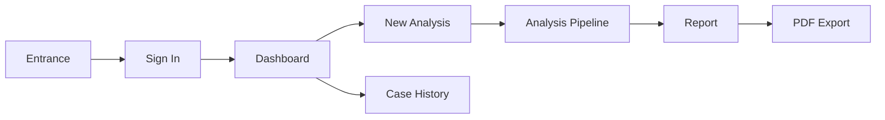
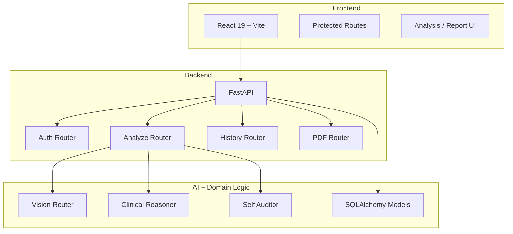

<p align="center">
  
</p>

<h1 align="center">OncoDetect</h1>

<p align="center">
  <b>Recruiter-ready full-stack oncology triage prototype</b><br />
  <sub>Clinical intake • vision inference routing • AI reasoning • audited reporting • PDF export</sub>
</p>

<p align="center">
  
  
  
  
  
</p>

## Overview

**OncoDetect** is a polished healthcare AI demo that simulates a clinical cancer triage workflow across:

- **brain MRI**
- **lung X-ray**
- **breast mammography**

It combines a cinematic frontend with a working FastAPI backend, authentication, persisted report history, PDF export, and AI-assisted clinical explanations.

> [!IMPORTANT]
> This project is for demonstration, portfolio, and educational use only. It is not a medical diagnosis system.

## What Recruiters Will Notice

- Full-stack product thinking, not just model code
- Clean React UX with protected routes and responsive layouts
- FastAPI backend with auth, history, and document generation
- Structured AI output with fallback behavior when external keys are unavailable
- Persistent case history for realistic product flow
- Production-minded deployment shape via `render.yaml`

## Product Flow



## Feature Set

| Area | Details |
| :-- | :-- |
| **Authentication** | Demo login gate with protected clinical routes |
| **Clinical Intake** | Patient demographics, symptoms, history, modality selection, scan upload |
| **Vision Routing** | Organ-specific image analysis path for brain, lung, and breast |
| **Reasoning Layer** | Doctor-facing and patient-facing structured explanations |
| **Audit Layer** | Secondary self-audit of report quality and safety flags |
| **Persistence** | Saved reports and browsable case history |
| **Reporting** | PDF export and clipboard summary flow |
| **UX** | Animated landing, dashboard, live analysis pipeline, cleaner typography and layout |

## Architecture



## Tech Stack

### Frontend

- React 19
- Vite 8
- Tailwind CSS 4
- Framer Motion
- Axios
- Lucide React

### Backend

- FastAPI
- Uvicorn
- SQLAlchemy
- SQLite for local persistence
- ReportLab
- Groq SDK
- Hugging Face model downloads for the vision router

## Local Setup

### Clone

```bash
git clone https://github.com/vishva2410/ONCO-DETECT-.git
cd ONCO-DETECT-
```

### Backend

```bash
cd backend
python3 -m venv .venv
source .venv/bin/activate
pip install -r requirements.txt
uvicorn main:app --reload --port 8000
```

### Frontend

```bash
cd frontend
npm install
npm run dev
```

### Open

```text
Frontend: http://127.0.0.1:5173
Backend:  http://127.0.0.1:8000
```

### Demo Credentials

```text
username: admin
password: password123
```

## Environment Notes

### Optional backend env vars

| Variable | Purpose |
| :-- | :-- |
| `GROQ_API_KEY` | Enables live Groq reasoning instead of template fallback |
| `FRONTEND_URL` | Allows production frontend origin in CORS |
| `DATABASE_URL` | Overrides local SQLite database |

### Optional frontend env vars

| Variable | Purpose |
| :-- | :-- |
| `VITE_API_URL` | Direct API base URL for deployed frontend |
| `VITE_BACKEND_PROXY_URL` | Dev-server proxy target override when local backend is not on `:8000` |

## Local Behavior Without API Keys

OncoDetect still works end to end without a `GROQ_API_KEY`.

In that mode the app:

- completes the analysis pipeline
- returns structured fallback reasoning
- marks the output with audit flags
- still saves the report and supports history + PDF export

That makes the repo easier to run for reviewers and recruiters.

## API Snapshot

### `POST /api/auth/login`

Authenticates a clinician and returns a bearer token.

### `POST /api/analyze`

Accepts multipart form data:

- `patient_data`
- `scan_file`

Returns structured report JSON including:

```json
{
  "reportId": "uuid",
  "organType": "lung",
  "probabilityScore": 0.85,
  "confidenceBand": [0.77, 0.93],
  "triageLevel": "high",
  "reasoningTrace": "Clinical reasoning...",
  "riskSummary": "High-risk triage summary...",
  "doctorExplanation": "Clinician-facing explanation...",
  "patientExplanation": "Patient-friendly explanation...",
  "triageRecommendation": "Next-step recommendation...",
  "recommendations": [],
  "differentialHints": ["...", "..."],
  "confidenceNote": "Reliability note...",
  "auditPassed": true,
  "auditFlags": [],
  "modelSource": "..."
}
```

### `GET /api/reports`

Returns saved case history for authenticated users.

### `GET /api/reports/{id}`

Returns a single saved report.

### `POST /api/report/generate`

Returns a downloadable PDF report.

## Deployment

This repo includes a Render blueprint in `render.yaml`.

Recommended deployment split:

- backend as a FastAPI web service
- frontend as a Vite-built static site

## Repo Structure

```text
.
├── backend/
│   ├── main.py
│   ├── database.py
│   ├── models/
│   ├── reasoning/
│   └── routers/
├── frontend/
│   ├── public/
│   ├── src/
│   ├── package.json
│   └── vite.config.js
├── render.yaml
├── start.sh
└── README.md
```

## Status

Current repo state includes:

- fixed local auth flow
- protected dashboard/history/report pages
- saved reports with working history retrieval
- successful PDF generation
- improved frontend scale and alignment
- configurable Vite proxy for cleaner local development

## License

Portfolio and educational use.
