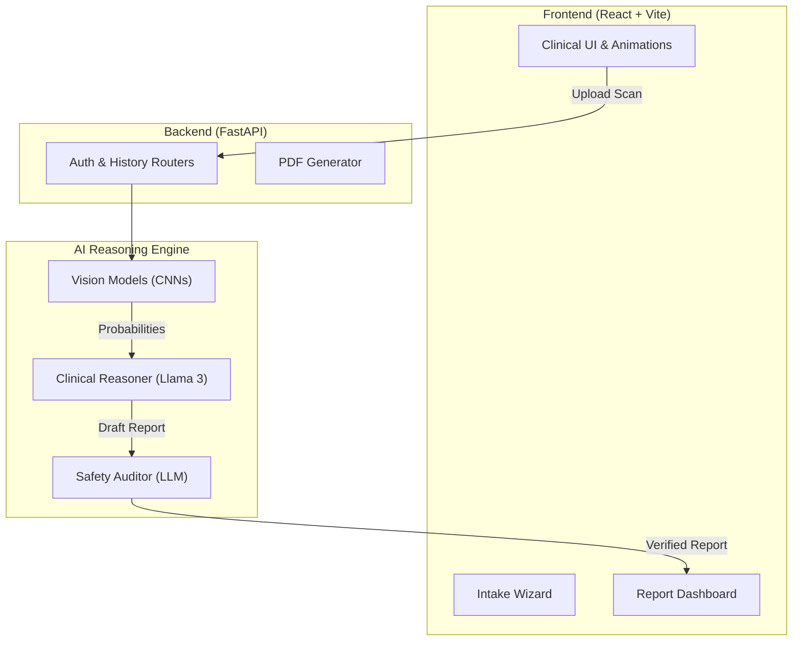

<p align="center">
  
</p>

<h1 align="center">✨ OncoDetect</h1>

<p align="center">
  <b>A premium, full-stack AI oncology triage prototype.</b><br />
  <sub>Built to demonstrate product-driven AI engineering, seamless UX, and robust clinical ML pipelines.</sub>
</p>

<p align="center">
  
  
  
  
  
</p>

<br/>

## 👋 Welcome to OncoDetect!

**OncoDetect** is a polished, end-to-end healthcare AI demonstration that simulates a modern clinical cancer triage workflow for **Brain MRIs**, **Lung X-rays**, and **Breast Mammography**. 

It’s completely open-source and built from the ground up to showcase what a production-ready AI product looks like. It combines a stunning, highly-animated React frontend with a powerful Python backend that runs multiple ML models and a Llama 3 LLM reasoning engine!

> [!CAUTION]
> **Disclaimer:** This project is a prototype built for portfolio, educational, and demonstration purposes only. It is **not** a real medical device and should never be used for clinical diagnosis. 

---

## 🚀 Key Features

* **🎨 Cinematic UX/UI:** Enjoy deep glassmorphism aesthetics, neon glows, and a simulated "neural link" scanning animation when processing medical images.
* **🧠 Multi-Model Vision Routing:** The backend dynamically routes uploaded scans to specific ML models (PyTorch, ONNX, Keras) based on the organ type.
* **💬 LLM Clinical Reasoning:** Uses Llama 3.3 70B via Groq to analyze the ML risk scores alongside patient demographics and symptoms, producing structured, readable clinical reports.
* **🛡️ Self-Auditor AI:** An entirely separate AI agent constantly reviews the generated reports in real-time to ensure no dangerous medical advice or hallucinations were printed.
* **📄 Print-Ready PDFs:** Clinicians can download professional, beautifully aligned PDF reports of the analysis via `ReportLab`.
* **📂 Full Persistence:** Complete user authentication and an SQLite database to store patient history securely.

---

## 🛠️ Architecture



---

## 💻 Tech Stack

**Frontend:** React 19, Vite 8, Tailwind CSS v4, Context API  
**Backend:** FastAPI, Uvicorn, SQLAlchemy, SQLite, ReportLab  
**AI / ML Ecosystem:** Hugging Face Models (`onnx`, `keras`, `pytorch`), Groq SDK (Llama 3.3 70B)

---

## ⚙️ Quick Start (Local Setup)

Want to run OncoDetect on your own machine? It's super easy!

1. **Clone the repository:**
   ```bash
   git clone https://github.com/vishva2410/ONCO-DETECT-.git
   cd ONCO-DETECT-
   ```

2. **Start the application:**
   If you're on a Mac or Linux, simply run our setup script!
   ```bash
   ./start.sh
   ```
   *This single command automatically builds the Python virtual environment, installs all pip and npm dependencies, and boots up both servers!*

3. **Enjoy!**
   - **Frontend:** `http://localhost:5173`
   - **Backend API:** `http://localhost:8000/docs`
   
   *(Use `admin` / `password123` to log into the demo portal)*

> **Note on API Keys:** The backend logic requires a free [Groq API Key](https://console.groq.com/) for the LLM reasoning to work perfectly. Place it in `backend/.env` as `GROQ_API_KEY=your_key_here`. 

---

## 🌍 Deployment

OncoDetect is fully ready for deployment on **Render.com**. 
A `render.yaml` infrastructure-as-code file is included in the root directory. 

To deploy:
1. Connect your Github Repo to Render via the "New Blueprint" button.
2. Render will automatically spin up the static frontend site and the FastAPI Python web service seamlessly!

---

<p align="center">
  <i>Built with ❤️ for the future of AI in Healthcare.</i>
</p>
