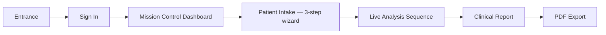
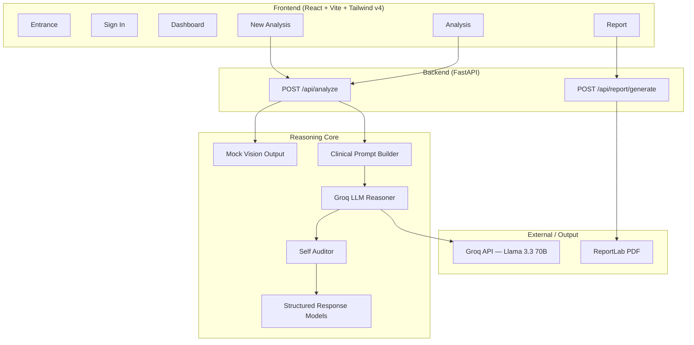
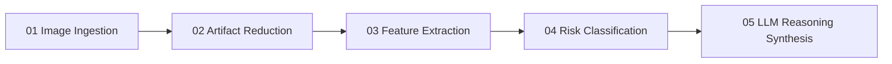
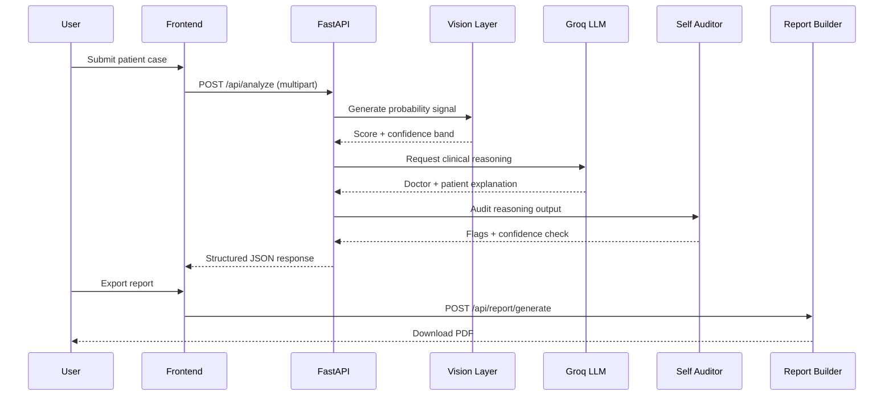
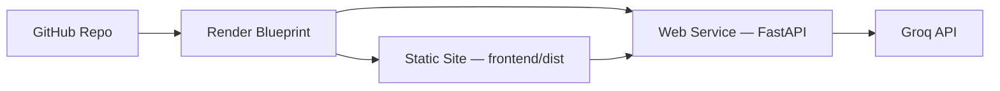

<p align="center">
  
</p>

<h1 align="center">OncoDetect</h1>

<p align="center">
  <b>AI-assisted multi-organ cancer triage workspace</b><br />
  <sub>Futuristic Mission Control UI · Clinical intake · LLM reasoning · Self-audited reporting</sub>
</p>

<p align="center">
  
  
  
  
  
  
</p>

<p align="center">
  <a href="#overview">Overview</a> •
  <a href="#ui--design-system">UI & Design</a> •
  <a href="#experience-map">Experience Map</a> •
  <a href="#architecture">Architecture</a> •
  <a href="#pipeline">Pipeline</a> •
  <a href="#quick-start">Quick Start</a> •
  <a href="#deployment">Deployment</a> •
  <a href="#api-snapshot">API</a>
</p>

---

## Overview

**OncoDetect** is a full-stack AI triage prototype for **brain**, **lung**, and **breast** cancer screening workflows. It combines:

- Futuristic **Mission Control** dark UI (`#050505` + `#00D4A8` cyan)
- Structured multi-step patient intake
- Simulated imaging model output with organ-specific probability scores
- Groq-powered **Llama 3.3 70B** clinical reasoning with real streaming feedback
- Self-audit verification layer
- PDF-ready clinical report export

> [!IMPORTANT]
> This repository is for **academic, portfolio, and demonstration use only**. It does **not** provide real medical diagnoses, and every output must be reviewed by a qualified clinician.

---

## UI & Design System

The UI was completely redesigned in v2.0 — a high-fidelity **Mission Control** aesthetic used consistently across every screen:

| Token | Value |
| :-- | :-- |
| Background | `#050505` (pure black) |
| Primary Accent | `#00D4A8` (clinical cyan) |
| Status: Critical | `#FF4444` (red) |
| Status: Observation | `#FFBC42` (amber) |
| Status: Normal | `#00D4A8` (cyan) |
| Typography | Space Grotesk (headlines) + Inter (body) |

All pages — Entrance, Sign In, Dashboard, Patient Intake, Analysis, Report — share the same color vocabulary. Animations use Framer Motion for page transitions and custom CSS for scanline, radar, and glow effects.

---

## Why It Stands Out

| Area | What It Does |
| :-- | :-- |
| **Mission Control UI** | Terminal-dark aesthetic with animated radar, scanlines, and live telemetry footer |
| **Clinical Intake** | 3-step wizard capturing demographics, symptoms, history, organ type, and scan upload |
| **AI Simulation** | Organ-specific probability output and confidence bands (brain / lung / breast) |
| **LLM Reasoning** | Live streaming log synced to the real Groq API call, color-coded by reasoning stage |
| **Self-Audit** | Second-pass review of reasoning quality and reliability before final output |
| **Reporting** | Doctor/patient view toggle, probability meter, heatmap panel, downloadable PDF |

---

## Experience Map



### Core Screens

| Screen | Purpose |
| :-- | :-- |
| **Entrance** | Animated terminal boot sequence — product entry point |
| **Sign In** | Secure credential gateway (demo mode: any credentials work) |
| **Dashboard** | Real-time triage metrics, live case pipeline, risk distribution |
| **New Analysis** | 3-step intake: Modality → Clinical History → Scan Upload |
| **Analysis** | Neural pipeline status + LLM reasoning stream + radar scan visual |
| **Report** | Triage output with heatmap, probability bar, doctor/patient explanation, PDF export |

---

## Architecture



---

## Pipeline

### 5-Stage Analysis Flow



### What Happens at Each Stage

| Stage | Responsibility | Output |
| :-- | :-- | :-- |
| **01 Image Ingestion** | Normalizes resolution, contrast, and DICOM metadata | Standardized image payload |
| **02 Artifact Reduction** | Gaussian filtering and edge-preserving smoothing | Clean input signal |
| **03 Feature Extraction** | Convolutional layer forward pass (ResNet/DenseNet sim) | Feature map |
| **04 Risk Classification** | Probability matrix across tissue classes | Score + confidence band |
| **05 LLM Reasoning** | Groq Llama 3.3 clinical narrative + self-audit | Doctor + patient reports |

### Sequence View



---

## Tech Stack

### Frontend

| Package | Version | Role |
| :-- | :-- | :-- |
| React | 19.x | UI framework |
| Vite | 8.x | Build tool + dev proxy |
| Tailwind CSS | 4.x | Utility-first styling |
| Framer Motion | 12.x | Page transitions + animations |
| Axios | 1.x | HTTP client |
| Lucide React | latest | Icon set |

### Backend

| Package | Role |
| :-- | :-- |
| FastAPI | REST API framework |
| Uvicorn | ASGI server |
| Pydantic | Schema validation |
| Groq SDK | LLM API client |
| python-dotenv | Environment config |
| ReportLab | PDF generation |

---

## Project Structure

```text
ONCO-DETECT-/
├── start.sh                   ← One-command local dev launcher
├── .gitignore
├── README.md
└── oncodetect/
    ├── render.yaml            ← Render deployment blueprint
    ├── backend/
    │   ├── main.py
    │   ├── requirements.txt
    │   ├── models/
    │   │   └── schemas.py
    │   ├── reasoning/
    │   │   ├── clinical_reasoner.py
    │   │   ├── prompt_builder.py
    │   │   └── self_auditor.py
    │   └── routers/
    │       ├── analyze.py
    │       └── report.py
    └── frontend/
        ├── package.json
        ├── vite.config.js     ← /api proxy → :8000
        └── src/
            ├── App.jsx
            ├── index.css      ← Design system tokens
            ├── components/
            │   ├── AppLayout.jsx
            │   ├── DisclaimerBanner.jsx
            │   ├── ErrorBoundary.jsx
            │   ├── LoadingSkeleton.jsx
            │   └── Toast.jsx
            ├── context/       ← Patient state management
            ├── hooks/
            ├── lib/           ← Axios API client
            └── pages/
                ├── Entrance.jsx
                ├── SignIn.jsx
                ├── Dashboard.jsx
                ├── NewAnalysis.jsx
                ├── Analysis.jsx
                └── Report.jsx
```

---

## Quick Start

### Option A — One Command (recommended)

```bash
git clone https://github.com/vishva2410/ONCO-DETECT-.git
cd ONCO-DETECT-
echo "GROQ_API_KEY=your_key_here" > oncodetect/backend/.env
zsh start.sh
```

`start.sh` automatically creates a Python venv, installs all dependencies, and starts both servers.

### Option B — Manual

**1. Clone**

```bash
git clone https://github.com/vishva2410/ONCO-DETECT-.git
cd ONCO-DETECT-/oncodetect
```

**2. Backend**

```bash
cd backend
python -m venv .venv
source .venv/bin/activate          # Windows: .venv\Scripts\activate
pip install -r requirements.txt
echo "GROQ_API_KEY=your_key_here" > .env
uvicorn main:app --reload --port 8000
```

**3. Frontend** (new terminal)

```bash
cd frontend
npm install
npm run dev
```

**4. Open**

```
Frontend  →  http://localhost:5173
Backend   →  http://localhost:8000
```

> The Vite dev server proxies all `/api` requests to `:8000` automatically — no cross-origin config needed.

---

## Deployment

This repo includes a **Render blueprint** at `oncodetect/render.yaml`.

### Deployment Topology



### Render Services

| Service | Root Dir | Build | Start / Publish |
| :-- | :-- | :-- | :-- |
| **Backend** | `oncodetect/backend` | `pip install -r requirements.txt` | `uvicorn main:app --host 0.0.0.0 --port $PORT` |
| **Frontend** | `oncodetect/frontend` | `npm ci && npm run build` | `dist` |

### Environment Variables

| Variable | Where | Purpose |
| :-- | :-- | :-- |
| `GROQ_API_KEY` | Backend | Enables LLM reasoning through Groq (required) |
| `FRONTEND_URL` | Backend | Adds production domain to CORS allowlist |
| `VITE_API_URL` | Frontend | Points the Axios client to the deployed backend |

---

## API Snapshot

### `POST /api/analyze`

Accepts `multipart/form-data`:

| Field | Type | Description |
| :-- | :-- | :-- |
| `patient_data` | JSON string | Demographics, symptoms, organ type |
| `scan_file` | File | Medical image (PNG / JPEG / DICOM) |

Returns:

```json
{
  "organType": "lung",
  "probabilityScore": 0.74,
  "confidenceBand": [0.68, 0.81],
  "triageLevel": "high",
  "reasoningTrace": "Structured clinical reasoning...",
  "riskSummary": "Overall triage summary...",
  "doctorExplanation": "Clinician-facing explanation...",
  "patientExplanation": "Patient-friendly explanation...",
  "triageRecommendation": "Suggested next step...",
  "differentialHints": ["Alternative A", "Alternative B"],
  "confidenceNote": "Reliability note...",
  "auditPassed": true,
  "auditFlags": [],
  "modelSource": "densenet121"
}
```

### `POST /api/report/generate`

Accepts the structured report payload → Returns `application/pdf`.

---

## Highlights for Reviewers

| | |
|:--|:--|
| 🎨 **UI/UX** | Fully custom Mission Control aesthetic — dark + cyan, animated radar/scanlines, terminal feel |
| 🔗 **Full-Stack** | React frontend + FastAPI backend + Groq LLM integration, end-to-end wired |
| 🧠 **LLM Chain** | Prompt builder → Groq Llama 3.3 → self-auditor → structured output |
| 📄 **PDF Export** | ReportLab-generated clinical PDFs |
| 🚀 **Deploy-Ready** | Render blueprint included, one-command local start |

---

## Notes

- The imaging layer is currently **simulated** (not a real CNN pipeline). The value is in workflow design, LLM orchestration, structured reporting, and full-stack execution.
- The app is intentionally built to look and behave like a polished clinical triage product demo.

---

## License

Educational, demonstration, and portfolio use.

---

<p align="center">
  <sub>Built by Vishva • OncoDetect v2.0 • FastAPI + React + Tailwind v4 + Groq Llama 3.3</sub>
</p>
